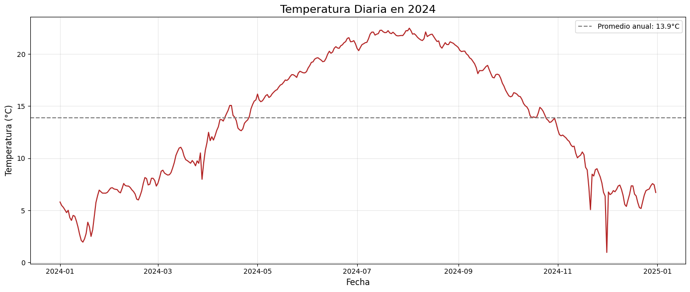
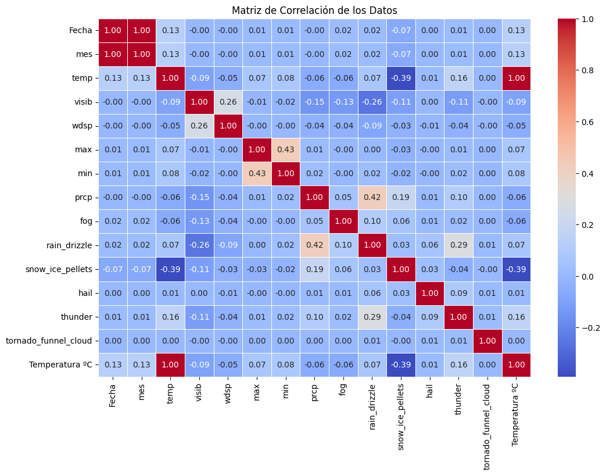
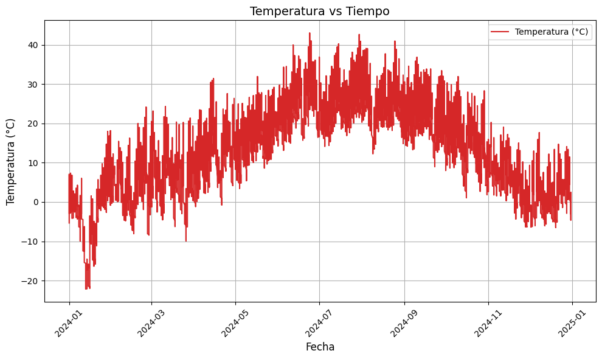
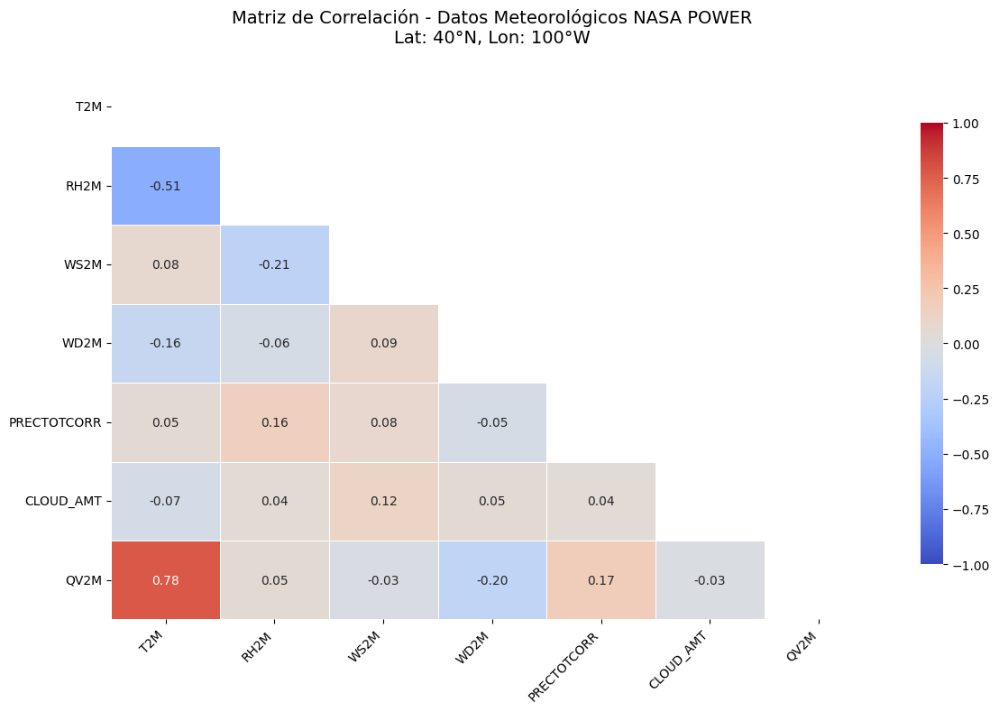
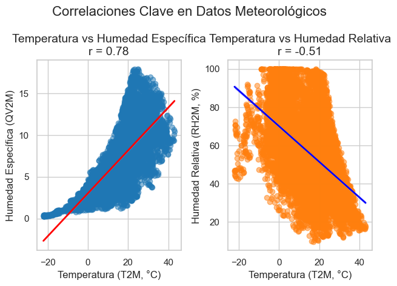
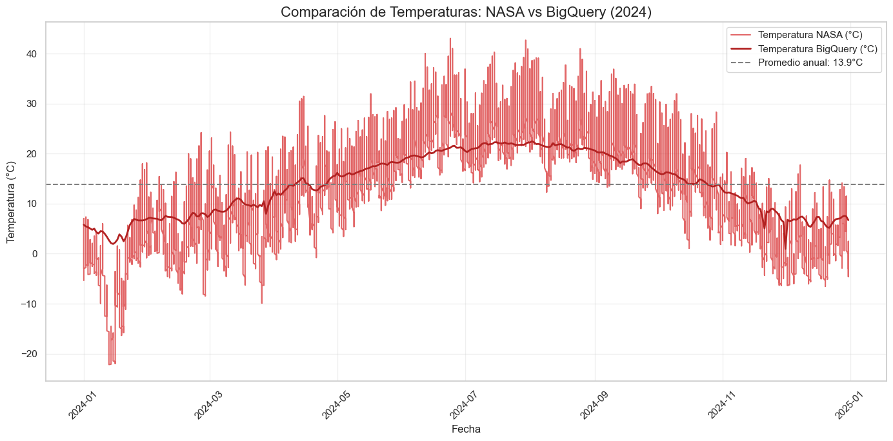
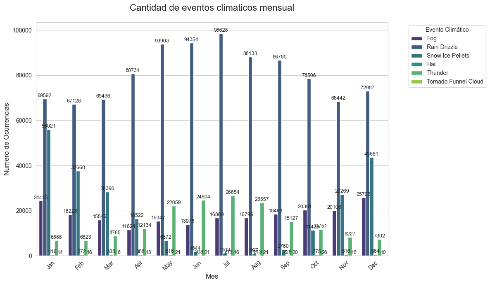
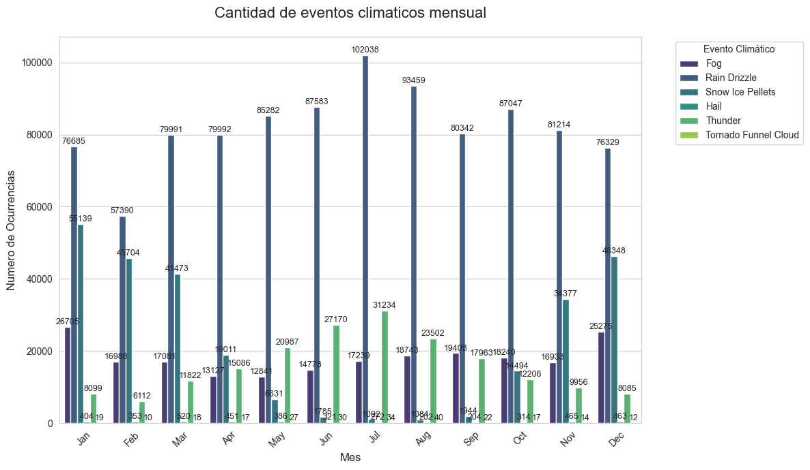
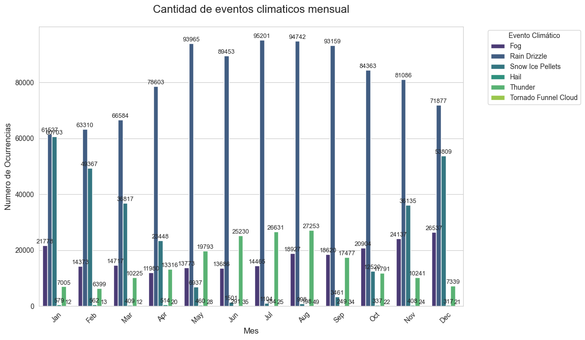
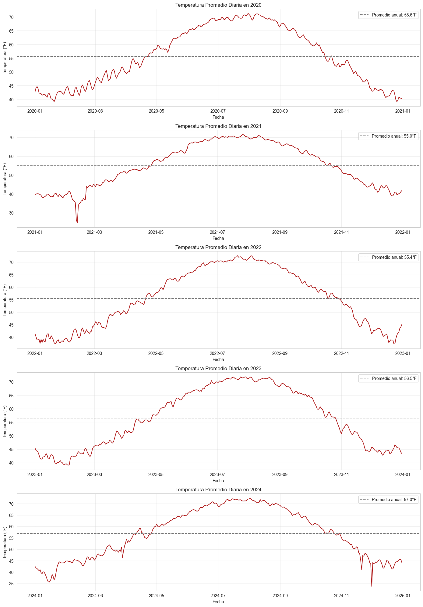

## Índice
1. [Exploración de Datos](#1-exploración-de-datos)
   - [Fuentes de Datos](#fuentes-de-datos)
   - [Datos Extraídos](#datos-extraídos)
2. [Limpieza y Transformación de Datos](#2-limpieza-y-transformación-de-datos)
   - [Procesos Realizados](#procesos-realizados)
   - [Filtros Aplicados](#filtros-aplicados)
3. [Visualización de Datos](#3-visualización-de-datos)
   - [Tendencia diaria de temperatura en 2024 (NOAA)](#31-tendencia-diaria-de-temperatura-en-2024-noaa)
   - [Matriz de correlación de variables meteorológicas (NOAA)](#32-matriz-de-correlación-de-variables-meteorológicas-noaa)
   - [Temperatura vs Tiempo (NASA POWER)](#33-temperatura-vs-tiempo-nasa-power)
   - [Matriz de correlación de variables meteorológicas (NASA POWER)](#34-matriz-de-correlación-de-variables-meteorológicas-nasa-power)
   - [Correlaciones clave en datos meteorológicos](#35-correlaciones-clave-en-datos-meteorológicos)
   - [Comparación de temperaturas: NASA vs NOAA](#36-comparación-de-temperaturas-nasa-vs-noaa)
4. [Análisis e Interpretación de Resultados](#4-análisis-e-interpretación-de-resultados)
   - [Hallazgos Clave](#hallazgos-clave)
   - [Estimación de Ubicación Geográfica](#estimación-de-ubicación-geográfica)
   - [Superposición de Gráficos](#superposición-de-gráficos)
   - [Correlaciones y Deducciones](#correlaciones-y-deducciones)
   - [Conclusiones](#conclusiones)
5. [Requisitos y Ejecución](#5-requisitos-y-ejecución)
   - [Requisitos](#requisitos)
   - [Ejecución](#ejecución)
6. [Créditos](#6-créditos)
# Análisis de Datos Climáticos: NOAA Global Surface Summary of the Day y NASA POWER API

Este proyecto analiza datos climáticos históricos y en tiempo real utilizando el dataset de **NOAA Global Surface Summary of the Day** y la API pública de **NASA POWER**. A continuación, se describen las etapas principales del proyecto, los hallazgos obtenidos y las deducciones realizadas.

## 1. Exploración de Datos

### Fuentes de Datos
- **NOAA Global Surface Summary of the Day**: Dataset público [`NOAA Global Surface Summary of the Day`](https://console.cloud.google.com/bigquery?ws=!1m4!1m3!3m2!1sbigquery-public-data!2snoaa_gsod) para datos históricos de temperaturas globales.
- **NASA POWER API**: Datos meteorológicos horarios obtenidos de la API pública de NASA POWER. Más información disponible en [`NASA POWER`](https://power.larc.nasa.gov/).

### Datos Extraídos
- **NOAA Global Surface Summary of the Day**: Datos de temperaturas globales para el año 2024.
- **NASA POWER**: Datos meteorológicos horarios, incluyendo temperatura, humedad, velocidad del viento, entre otros.

---

## 2. Limpieza y Transformación de Datos

### Procesos Realizados
- **NOAA Global Surface Summary of the Day**:
  - Eliminación de columnas irrelevantes.
  - Renombrado de columnas para mayor claridad.
  - Conversión de fechas al formato `datetime`.
  - Conversión de temperaturas de Fahrenheit a Celsius.
  - Ordenamiento de datos por fecha.

- **NASA POWER**:
  - Conversión del índice a formato `datetime`.
  - Normalización de datos para alinearlos con el formato del dataset de NOAA.
  - Unión de ambos datasets utilizando la columna de fechas.

### Filtros Aplicados
- Período de estudio: Año 2024.
- Ubicación específica: Latitud 40°N, Longitud 100°W.

---

## 3. Visualización de Datos

Se generaron las siguientes visualizaciones utilizando **Matplotlib** y **Seaborn**:

### 3.1 Tendencia diaria de temperatura en 2024 (NOAA)




### 3.2 Matriz de correlación de variables meteorológicas (NOAA)




### 3.3 Temperatura vs Tiempo (NASA POWER)




### 3.4 Matriz de correlación de variables meteorológicas (NASA POWER)




### 3.5 Correlaciones clave en datos meteorológicos




### 3.6 Comparación de temperaturas: NASA vs NOAA



---

## 4. Análisis e Interpretación de Resultados

### Estimación de Ubicación Geográfica
El análisis de la evolución de las temperaturas a lo largo de un año permitió estimar la ubicación geográfica correspondiente a los datos del dataset de NOAA. Al observar las tendencias y patrones de temperatura, se dedujo que la ubicación más probable era **Latitud: 40°N, Longitud: 100°W**. Esta estimación se validó al comparar los datos de NOAA con los datos obtenidos de la API de NASA POWER para la misma ubicación.

### Correlaciones y Deducciones
El análisis de las correlaciones entre las variables meteorológicas reveló los siguientes hallazgos clave:
- **Temperatura y Humedad Específica (r = 0.78)**: Existe una fuerte correlación positiva entre la temperatura y la humedad específica. Esto sugiere que a medida que la temperatura aumenta, la cantidad de vapor de agua en el aire también tiende a aumentar. Este comportamiento es consistente con las leyes físicas que relacionan la capacidad del aire para retener humedad con la temperatura.
- **Temperatura y Humedad Relativa (r = -0.51)**: Se observó una correlación negativa moderada entre la temperatura y la humedad relativa. Esto indica que, aunque la cantidad absoluta de vapor de agua puede aumentar con la temperatura, la humedad relativa disminuye porque el aire más cálido puede contener más vapor de agua antes de saturarse.
- **Velocidad del Viento y Precipitación**: Aunque no se identificaron correlaciones fuertes entre estas variables, los datos sugieren que la velocidad del viento puede influir en la distribución de la precipitación en ciertas condiciones climáticas.

### Deducciones Adicionales
1. **Efectos Regionales**: La ubicación geográfica estimada (Latitud: 40°N, Longitud: 100°W) corresponde a una región con un clima continental. Esto explica las variaciones significativas en las temperaturas diarias y estacionales observadas en los datos.
2. **Impacto del Cambio Climático**: Las correlaciones observadas entre la temperatura y las variables relacionadas con la humedad son consistentes con los efectos esperados del cambio climático, como un aumento en la capacidad del aire para retener humedad y cambios en los patrones de precipitación.
3. **Validación de Fuentes**: La similitud en las tendencias de temperatura entre los datos de NOAA y NASA POWER valida la consistencia de ambas fuentes y refuerza la confiabilidad de los resultados.
4. **Modelado Climático**: Las correlaciones identificadas pueden ser útiles para desarrollar modelos predictivos que analicen el impacto del cambio climático en variables meteorológicas clave, como la humedad y la precipitación.
5. **Análisis Temporal**: La tendencia de aumento gradual en las temperaturas diarias sugiere un patrón consistente con el calentamiento global, lo que podría tener implicaciones significativas para la agricultura, los recursos hídricos y la biodiversidad en la región estudiada.


### Conclusiones
- Los datos sugieren un aumento en las temperaturas globales, consistente con las tendencias de cambio climático.
- Las correlaciones identificadas pueden ser útiles para modelar el impacto del cambio climático en variables meteorológicas.

---

## 5. Requisitos y Ejecución

### Requisitos
El archivo `requirements.txt` incluye las librerías necesarias para ejecutar el proyecto:
```
google-cloud-bigquery
pandas
matplotlib
seaborn
requests
numpy
```

### Ejecución
1. Clonar el repositorio.
2. Instalar las dependencias: `pip install -r requirements.txt`.
3. Ejecutar el archivo Jupyter Notebook para reproducir el análisis.

---

## Créditos
Este proyecto fue desarrollado como parte de un análisis de datos climáticos utilizando herramientas modernas de ciencia de datos.  


          


# Análisis de Eventos Climáticos y Comparación de Temperaturas

Este proyecto utiliza datos meteorológicos públicos de NOAA GSOD para analizar eventos climáticos y comparar temperaturas promedio diarias entre los años 2020 y 2024. El análisis incluye la limpieza de datos, el conteo de eventos climáticos, y la visualización de tendencias de temperatura y ocurrencias de eventos.

## Requisitos Previos

- **Python 3.7+**
- **Bibliotecas necesarias**:
  - `google-cloud-bigquery`
  - `pandas`
  - `matplotlib`
  - `seaborn`
  - `calendar`
## Notas
- Asegúrate de reiniciar el kernel si cambias el año para evitar errores de caché.
- Los datos extraídos están limitados a las columnas necesarias para optimizar el rendimiento.

  
## Configuración

1. **Google Cloud SDK**: Configura el SDK de Google Cloud y autentica tu cliente para acceder a BigQuery.
2. **Dependencias**: Instala las bibliotecas necesarias ejecutando:
   ```bash
   pip install google-cloud-bigquery pandas matplotlib seaborn
   ```

## Funcionalidades

### 1. Extracción de Datos
El código utiliza BigQuery para extraer datos meteorológicos de un año específico. Puedes cambiar el año modificando la variable `year` en el código.

### 2. Limpieza de Datos
Se eliminan columnas innecesarias y se convierten las fechas al formato adecuado. Además, se filtran filas con datos inválidos.

### 3. Análisis de Eventos Climáticos
- Se cuentan las ocurrencias de eventos como niebla, lluvia, nieve, granizo, tormentas eléctricas, y tornados.
- Los resultados se presentan en un DataFrame y en un gráfico de barras mensual.

### 4. Comparación de Temperaturas
- Se generan gráficos de líneas para comparar las temperaturas promedio diarias entre los años 2020 y 2024.
- Cada gráfico incluye una línea de referencia con la temperatura promedio anual.

## Uso

1. **Ejecutar el Notebook**:
   - Abre el archivo `.ipynb` en Jupyter Notebook o Google Colab.
   - Ejecuta las celdas en orden para realizar el análisis.

2. **Modificar el Año**:
   - Cambia la variable `year` para analizar un año diferente.

3. **Visualización**:
   - Los gráficos generados muestran tendencias de temperatura y ocurrencias de eventos climáticos.

## Resultados Esperados

- **Gráficos de Temperatura**: Comparación visual de las temperaturas promedio diarias para cada año.
- **Resumen de Eventos Climáticos**: Tabla y gráfico que muestran la cantidad de ocurrencias por tipo de evento y mes.

## Ejemplo de Salida

### Resumen de Eventos Climáticos
| Evento                  | Ocurrencia | Porcentaje |
|-------------------------|------------|------------|
| Fog                    | 120        | 10.5%      |
| Rain Drizzle           | 85         | 7.4%       |
| Snow Ice Pellets       | 30         | 2.6%       |


### Gráficos
## 1. Cantidad de eventos climaticos mensual 2024

## 2. Cantidad de eventos climaticos mensual 2023

## 3. Cantidad de eventos climaticos mensual 2022

## 4. Temperaturas promedio 2020-2024


## Análisis Detallado

### 1. **Eventos Climáticos**
El análisis de eventos climáticos incluye fenómenos como niebla, lluvia, nieve, granizo, tormentas eléctricas y tornados. Los datos se procesan para calcular la cantidad de ocurrencias de cada evento por mes y se visualizan en gráficos de barras.

#### Observaciones:
- **Frecuencia Relativa**: Algunos eventos, como la niebla, ocurren con mayor frecuencia que otros, como los tornados, que son más raros pero potencialmente más destructivos.
- **Evento mas recurrente**: El fenomeno meteorologico mas comun es la lluvia-llovizna, probablemente influenciado por la ubicacion geografica de los datos (E.E.U.U.) 
- **Cantidades de registros**: Se puede apreciar una gran cantidad de registros de cada fenomeno, esto puede deberse a que tan seguido se registraron las mediciones  
### 2. **Tendencias de Temperatura**
Se comparan las temperaturas promedio diarias de los años 2020 a 2024 mediante gráficos de líneas. Cada gráfico incluye una línea de referencia que representa la temperatura promedio anual.

#### Observaciones:
- **Variabilidad Anual**: Las temperaturas muestran fluctuaciones ligeras entre los años, lo que podría estar relacionado con el cambio climatico
- **Estacionalidad**: Se observa un patrón estacional claro, con temperaturas más altas en verano y más bajas en invierno.
- **Promedio Anual**: Aunque las temperaturas promedio anuales son relativamente estables, hay ligeras tendencias de aumento en algunos años, lo que podría ser indicativo de un cambio climático gradual.

## Conclusiones

1. **Impacto de los Eventos Climáticos**:
   - Los eventos climáticos tienen una distribución estacional marcada, lo que sugiere que están influenciados por factores como la ubicación geográfica y las condiciones climáticas globales.


2. **Tendencias de Temperatura**:
   - Las temperaturas promedio anuales muestran una ligera tendencia al alza, lo que podría ser consistente con los efectos del cambio climático.
   - La variabilidad estacional y anual destaca la importancia de monitorear las temperaturas a largo plazo para identificar patrones significativos.

3. **Recomendaciones**:
   - **Monitoreo Continuo**: Es crucial continuar recopilando y analizando datos meteorológicos para comprender mejor los patrones climáticos y sus implicaciones.
   - **Preparación para Eventos Extremos**: Las comunidades deben estar preparadas para eventos climáticos extremos, especialmente aquellos que son menos frecuentes pero más destructivos, como los tornados.


