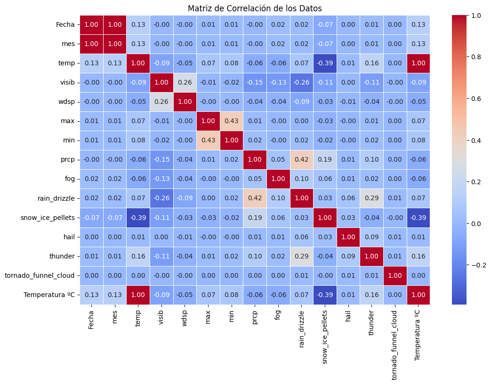
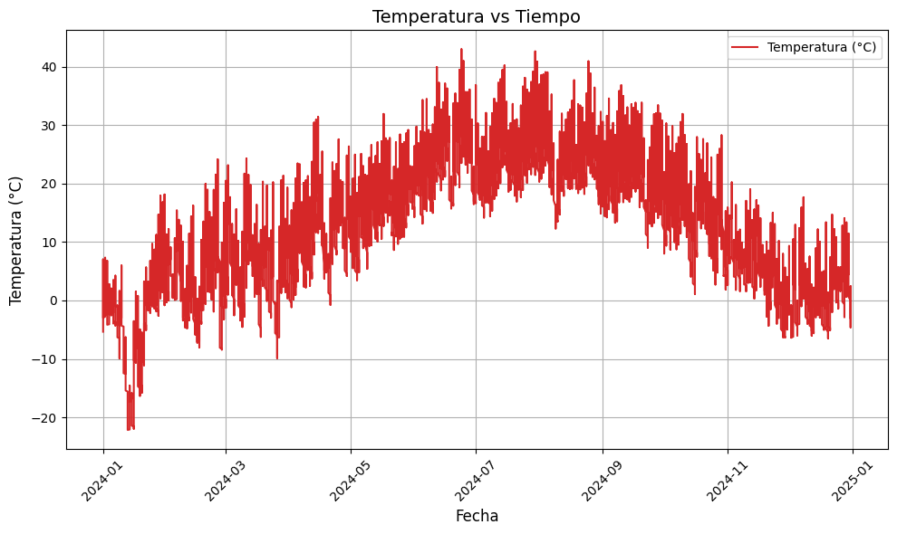
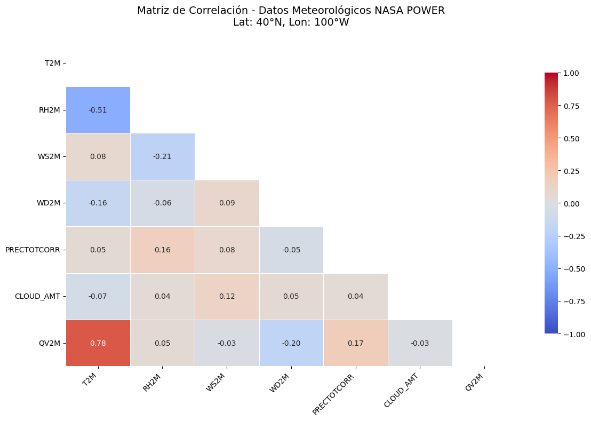
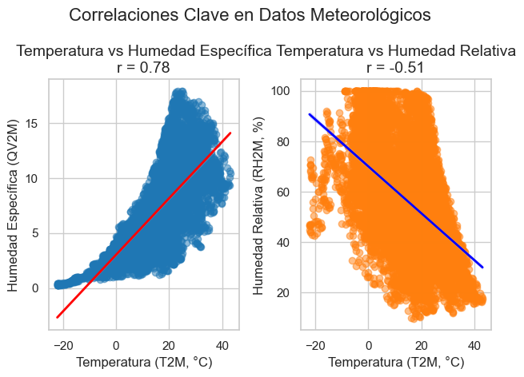

# Análisis de Datos Climáticos: BigQuery y NASA POWER API

Este proyecto analiza datos climáticos históricos y en tiempo real utilizando BigQuery y la API pública de NASA POWER. A continuación, se describen las etapas principales del proyecto y los hallazgos obtenidos.

## 1. Exploración de Datos

### Fuentes de Datos
- **BigQuery**: Dataset público `bigquery-public-data.noaa_gsod.gsod2024` para datos históricos de temperaturas globales.
- **NASA POWER API**: Datos meteorológicos horarios para una ubicación específica (Latitud: 40°N, Longitud: 100°W).

### Datos Extraídos
- **BigQuery**: Datos de temperaturas globales para el año 2024.
- **NASA POWER**: Datos meteorológicos horarios, incluyendo temperatura, humedad, velocidad del viento, entre otros.

---

## 2. Limpieza y Transformación de Datos

### Procesos Realizados
- **BigQuery**:
  - Eliminación de columnas irrelevantes.
  - Renombrado de columnas para mayor claridad.
  - Conversión de fechas al formato `datetime`.
  - Conversión de temperaturas de Fahrenheit a Celsius.
  - Ordenamiento de datos por fecha.

- **NASA POWER**:
  - Conversión del índice a formato `datetime`.
  - Normalización de datos para alinearlos con el formato de BigQuery.
  - Unión de ambos datasets utilizando la columna de fechas.

### Filtros Aplicados
- Período de estudio: Año 2024.
- Ubicación específica: Latitud 40°N, Longitud 100°W.

---

## 3. Visualización de Datos

Se generaron las siguientes visualizaciones utilizando **Matplotlib** y **Seaborn**:

### 3.1 Tendencia diaria de temperatura en 2024 (BigQuery)


### 3.2 Matriz de correlación de variables meteorológicas (BigQuery)




### 3.3 Temperatura vs Tiempo (NASA POWER)




### 3.4 Matriz de correlación de variables meteorológicas (NASA POWER)




### 3.5 Correlaciones clave en datos meteorológicos




### 3.6 Comparación de temperaturas: NASA vs BigQuery


---
## 4. Análisis e Interpretación de Resultados

### Hallazgos Clave
- **Tendencias de Temperatura**: Aumento gradual de las temperaturas durante el año 2024.
- **Correlaciones**:
  - Fuerte correlación positiva entre temperatura y humedad específica (r = 0.78).
  - Correlación negativa entre temperatura y humedad relativa (r = -0.51).
- **Comparación de Fuentes**: Los datos de BigQuery y NASA POWER mostraron tendencias similares, validando la consistencia entre ambas fuentes.

### Conclusiones
- Los datos sugieren un aumento en las temperaturas globales, consistente con las tendencias de cambio climático.
- Las correlaciones identificadas pueden ser útiles para modelar el impacto del cambio climático en variables meteorológicas.

---

## 5. Requisitos y Ejecución

### Requisitos
El archivo `requirements.txt` incluye las librerías necesarias para ejecutar el proyecto:
```
google-cloud-bigquery
pandas
matplotlib
seaborn
requests
numpy
```

### Ejecución
1. Clonar el repositorio.
2. Instalar las dependencias: `pip install -r requirements.txt`.
3. Ejecutar el archivo Jupyter Notebook para reproducir el análisis.

---

## Créditos
Este proyecto fue desarrollado como parte de un análisis de datos climáticos utilizando herramientas modernas de ciencia de datos.
